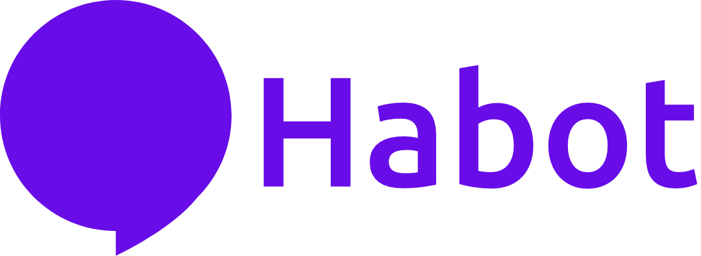

# habot

Habot is a coach for creating daily healthy habits through a conversational interface.

As you’re onboarded with Habot, you rate how well you’re doing in certain life areas. Habot then recommends a set of habits that would be best to work on. After committing to a habit, you track progress with Habot every day through delightful text message exchanges. You earn a new streak every 3 consecutive successful days and are encouraged to collect at least 7 streaks to create the new habit (21 days in total).

Habits included are built off of BJ Fogg's Tiny Habit principles (http://tinyhabits.com/) - that is they are:
- incredibly specific
- can be done in 30 seconds or less

If you have examples of Tiny Habits you would like added to Habot, please email me!

## Current features:

### Onboarding:
- Mobile phone number + country.
- Timezone.
- Name.
- Ratings for 'profile' (health categories: mind, sleep, relationships, performance, movement, nutrition).
- Habit selection.
- Time to be reminded.

### Signin
- 'Passwordless' sign up and sign in via a 6 digit randomly generated pin sent to verify mobile number.

### Dashboard
- Data visualization to track progress toward 3 day streaks and number of 3-day streaks (with encouragement to collect 7 x 3-day streaks or 21 days total).

### Conversation features:
- Daily reminders sent @ specified time in local time zone.
- Success tracking via reply with '#yes'.
- Pausing of habit tracking if inactive for > 7 days.  Reactivation with 'unpause'
- Small talk :)

### API integrations:
- Twilio
- DialogFlow

### Tech stack:
- PostgreSQL
- SQL Alchemy
- Python
- Flask
- Jinja
- JQuery
- Bootstrap
- CSS
- HTML
- JavaScript

### Libraries utilized:
- schedule
- arrow
- phonenumbers
- pycountry
- pytz
- emoji
- D3
- TypeIt

## Next Features:
- testing framework that forces specific servertime to automate test user cases 
- handling all errors during sign up flow
- fixes with the scheduling utility / thread
- preparations for deployment to habot.me

## Video of current local build: 

https://drive.google.com/open?id=0BxzJpyba64UfX2pHd2NpUk5wMm8

## Data model: 

## Notes on cloning: 
1. You'll need a Twilio and DialogFlow account. 
2. At a minimum, your DialogFlow agent needs to be programmed to recognize '#yes' and 'unpause'.
3. To process user responses, configure DialogFlow for fulfillment.  I used ngrok to create a webook at '/'.

